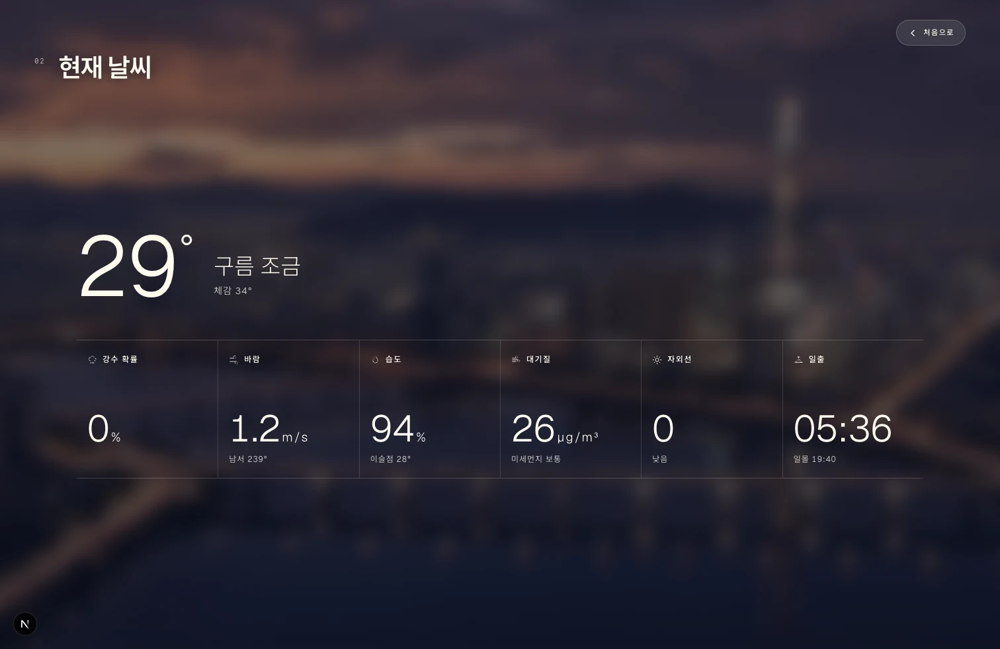
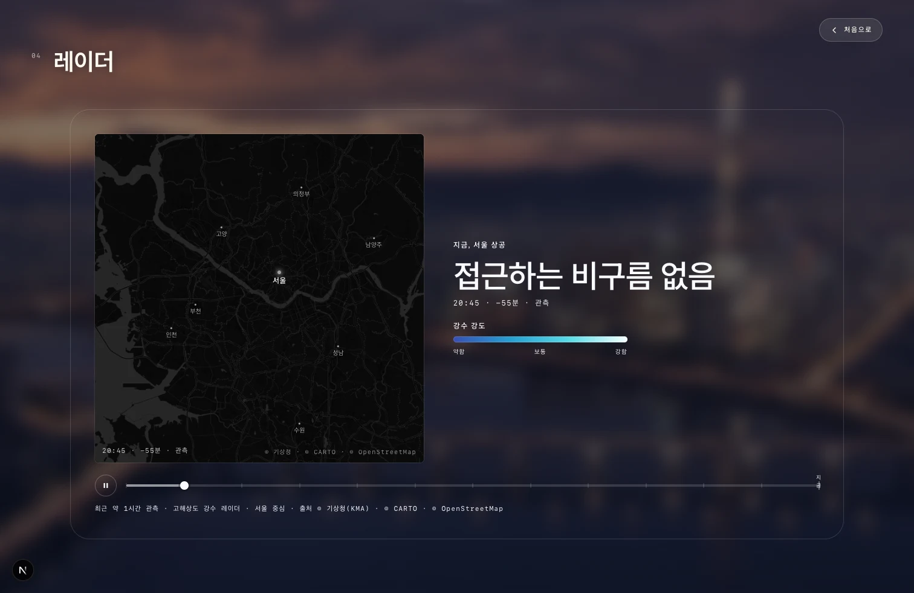
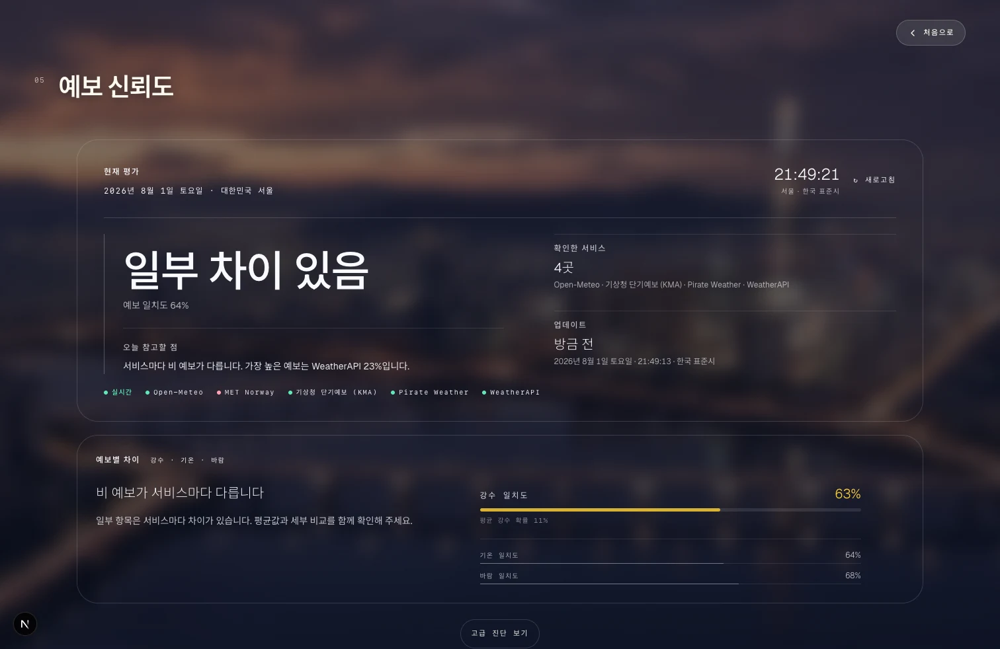
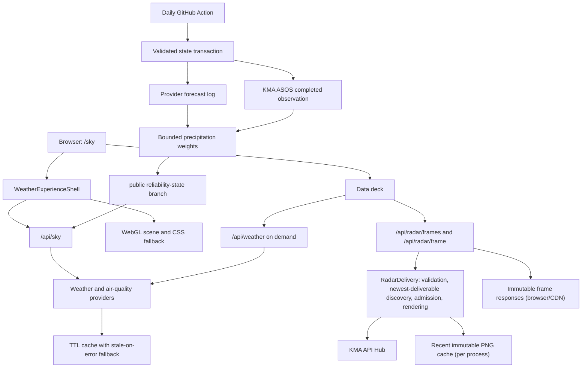

# SeoulSky

[](https://nextjs.org/)
[](https://react.dev/)
[](https://www.typescriptlang.org/)
[](https://github.com/mhju0/seoulsky/actions/workflows/precip-reliability.yml)

<p align="center">
  
</p>

SeoulSky is a Seoul-only weather experience that pairs a cinematic live scene with the practical details needed to plan the day: current conditions, KMA radar, hourly and seven-day forecasts, and transparent forecast confidence. Its adaptive precipitation ensemble verifies completed provider forecasts against KMA observations and gradually learns how much influence to give each source. It stays useful when optional providers or the learning state are unavailable.

**Live demo:** [seoulsky.vercel.app/sky](https://seoulsky.vercel.app/sky)

## License

Copyright (c) 2026 Michael Ju. All rights reserved.
No license is granted for use, copying, modification, or distribution of this code as of 2026-07-30. This repository is public for portfolio review purposes only.

## What it solves

Weather apps often make a user choose between an atmospheric overview and a dense data dashboard. SeoulSky keeps both in one focused flow:

- A persistent Seoul scene provides the immediate sense of current conditions.
- The data deck answers whether rain is approaching, what the forecast shows, and how much providers agree.
- Advanced diagnostics separate **today's provider agreement** from **historical precipitation skill**, including the exact weights used for the current forecast.
- Open-Meteo provides a keyless baseline; optional KMA, AirKorea, MET Norway, Pirate Weather, and WeatherAPI sources enrich the result without becoming a single point of failure.

The primary route is `/sky`. Press `D` on desktop, or use the detail control on mobile, to open the data deck; press `Esc` to return to the scene.

## Screenshots

| Current conditions | Rain radar |
| --- | --- |
|  |  |
| **Forecast** | **Forecast confidence** |
|  |  |

The confidence deck expands into the precipitation-learning state and a full source comparison. It shows the evidence depth, safety-gate mode, current effective weights, stored learned profile, and every provider's current reading side by side.

<p align="center">
  
</p>

## Learns from completed precipitation forecasts

Every day at approximately 06:10 KST, the [`precip-reliability`](.github/workflows/precip-reliability.yml) GitHub Action runs a bounded online-learning cycle for Seoul precipitation:

1. Log tomorrow's precipitation forecast from every available provider.
2. Fetch yesterday's completed KMA ASOS daily precipitation observation for Seoul station 108.
3. Score informative provider forecasts against that independent observation.
4. Update bounded multiplicative weights and publish the validated snapshot to the public [`reliability-state`](https://github.com/mhju0/seoulsky/tree/reliability-state/data/reliability) branch.

The action restores, runs, validates, and publishes through one transaction. A revision conflict or invalid/regressive candidate fails without replacing the remote snapshot.

Release commits ignore generated reliability files. Vercel also skips deployments for `reliability-state`, so learning updates do not create application releases.

The web runtime reads and validates learned weights from that branch before blending forecasts. It begins with equal weights and gradually mixes in learning as evidence accumulates.

Missing, stale, malformed, or disabled state returns to equal weighting. Only providers that answer participate, and weights renormalize over that subset instead of treating missing data as zero.

This is precipitation-only forecast verification, not a claim that SeoulSky retrains a weather model or is proven more accurate than its sources. Correct-dry days and missing observations do not manufacture evidence. The advanced diagnostics make the current mode, completed-date count, scored provider forecasts, observation freshness, and exact effective versus stored weights visible. See [`lib/reliability/README.md`](lib/reliability/README.md) for scoring, persistence, recovery, and runtime-gate details.

## Engineering choices

- **Adaptive precipitation ensemble:** completed forecasts are scored against KMA ASOS observations and converted into bounded, safely gated provider weights.
- **Raw WebGL with a CSS fallback:** the background uses a small custom shader rather than a scene graph, while a fallback preserves the experience when WebGL is unavailable.
- **React stays outside the animation loop:** scene updates use refs and browser APIs, avoiding per-frame React renders.
- **Fast and detailed APIs are separate:** `/api/sky` serves the live scene; `/api/weather` supplies deferred provider comparison and confidence details.
- **Atomic provider snapshots:** each forecast provider returns its availability, cache freshness, and normalized current, hourly, and daily weather together from one cached generation. The live snapshot, deferred comparison, runtime consensus, and scheduled forecast log all reuse that read; unavailable sources are omitted where a value is required rather than invented.
- **Graceful data degradation:** cached last-good data and provider-specific fallbacks avoid blank states or invented certainty.
- **Server-side integrations:** provider keys, raw radar grids, and upstream requests remain off the client.
- **Bounded radar delivery:** `RadarDelivery` validates KMA keys against the recent observed window and discovers the newest deliverable observation by stepping backward at most 30 minutes, in five-minute increments, only when KMA explicitly reports that a candidate is not published yet. It admits at most two renders and eight queued renders per process, coalesces same-key work, and caches only recent immutable PNGs in that process; a produced frame is separately cacheable by the browser/CDN. One abortable browser loader fetches and decodes frames sequentially in active/playback order, honors bounded `Retry-After` backoff for temporary pressure, renders only decoded blob URLs, and waits for ready frames without breaking circular playback.

## Architecture



Forecast providers are read through one Provider Snapshot boundary. A snapshot keeps status (including cache and stale metadata) coherent with the current, hourly, and daily weather it serves; a stale last-good snapshot remains an available snapshot, while missing configuration or a failed fetch produces an empty non-OK snapshot. The shared provider cache is reused by the live Sky snapshot, deferred Weather Intelligence comparison, runtime precipitation collection, and daily forecast log. Those consumers omit non-OK sources instead of fabricating weather or treating missing values as zero. Provider priority remains Open-Meteo, MET Norway, KMA, Pirate Weather, then WeatherAPI; the first live current snapshot remains the diagnostics primary.

Radar routes are thin HTTP adapters over `RadarDelivery`. A timeline starts at the nominal newest permitted key and scans backward through at most six older five-minute candidates only while KMA classifies each miss as not yet published. The first deliverable candidate anchors the complete 13-frame oldest-to-newest observed window; a busy, cancelled, timed-out, malformed, or terminal upstream result stops discovery instead of masking the failure with older data. Discovery does not pre-render the other playback keys or promise later cache hits. Frame work remains limited to the current 90-minute observed window. The in-memory PNG cache and render admission are process-local, while each successfully produced immutable PNG carries a one-day browser/CDN cache policy. Invalid, busy, cancelled, and unavailable frame requests return explicit non-cacheable responses; admission pressure includes delivery-owned `Retry-After` metadata.

## Stack

| Area | Technology |
| --- | --- |
| App | Next.js 16, React 19, TypeScript |
| Styling | Tailwind CSS 4 and custom CSS |
| Rendering | Raw WebGL and CSS fallback |
| Motion | Framer Motion |
| Weather | Open-Meteo baseline with optional Korean and international providers |
| Radar | KMA API Hub frames rendered server-side |
| Reliability | Daily GitHub Actions verification, KMA ASOS ground truth, bounded multiplicative weights |

## Run locally

Requires Node.js 22 or later.

```bash
npm ci
install -m 600 .env.example .env.local # optional provider configuration, owner-readable only
npm run dev
```

Open [http://localhost:3000/sky](http://localhost:3000/sky).

No API key is required for the basic experience. Optional provider configuration is documented in [`.env.example`](.env.example), and source contracts and attribution live in [docs/weather-sources.md](docs/weather-sources.md).

The scheduled learning job requires a GitHub Actions `KMA_OBSERVATION_API_KEY` secret subscribed to the KMA ASOS daily service. Without it, forecasts continue to be logged but completed days are not scored.

## Verification

```bash
npm run lint
npx tsc --noEmit
npm test
npm run build
```

For a manual check, verify `/sky` at desktop and mobile widths, open the data deck, and confirm the radar, forecast, and confidence sections remain usable.

## Limits

- Seoul-only and desktop-first by design.
- Optional providers may be unavailable without interrupting the baseline experience.
- Radar requires `KMA_APIHUB_KEY` and an available KMA source. Its delivery limits are two active renders plus eight queued renders per process; a full queue is temporarily busy, and the process-local PNG cache is neither shared nor durable.
- Timeline discovery checks no more than seven newest candidates and falls back only across explicit not-yet-published results. Other frames render on demand. Browser warming owns one fetch/decode pipeline, retries temporary 429/503 pressure in a three-attempt batch plus one cancellable re-entry batch (six automatic attempts maximum, 60-second delay cap), and skips only terminally failed frames. Exhausted pressure pauses playback honestly and remains retryable with Play.
- Learned weights cover Seoul precipitation only. They describe historical provider skill, not certainty about today's weather.
- Evidence advances on informative completed precipitation forecasts, not simply once per calendar day.
- Weather information is not suitable for safety-critical decisions.
