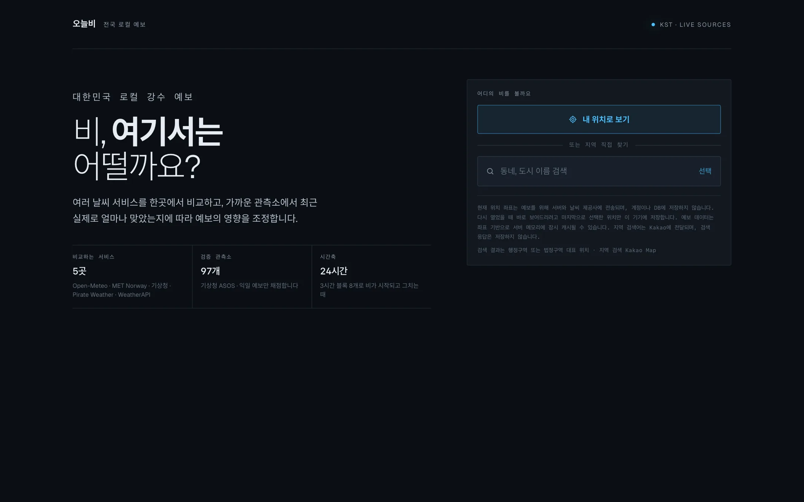
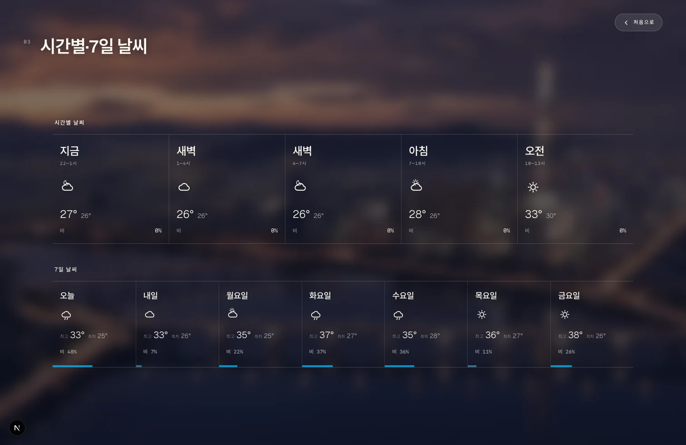
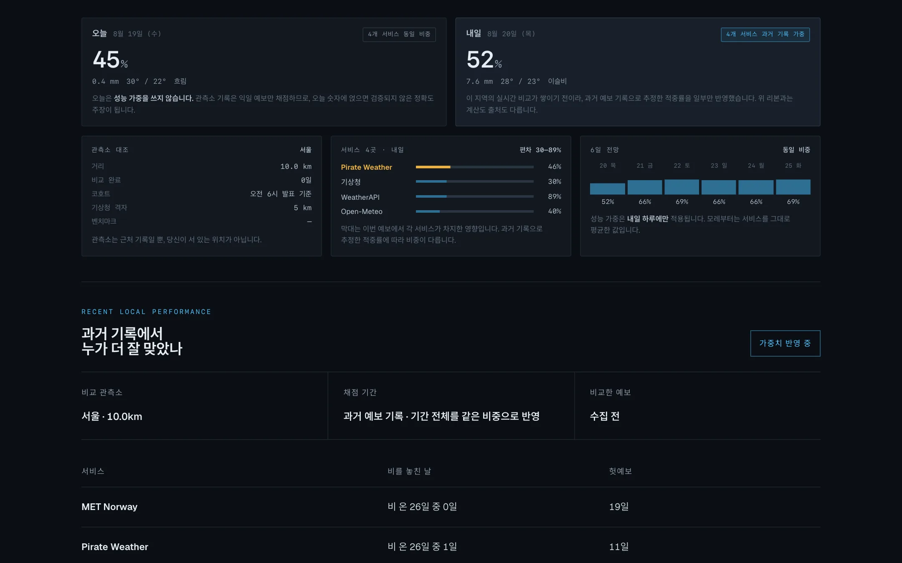
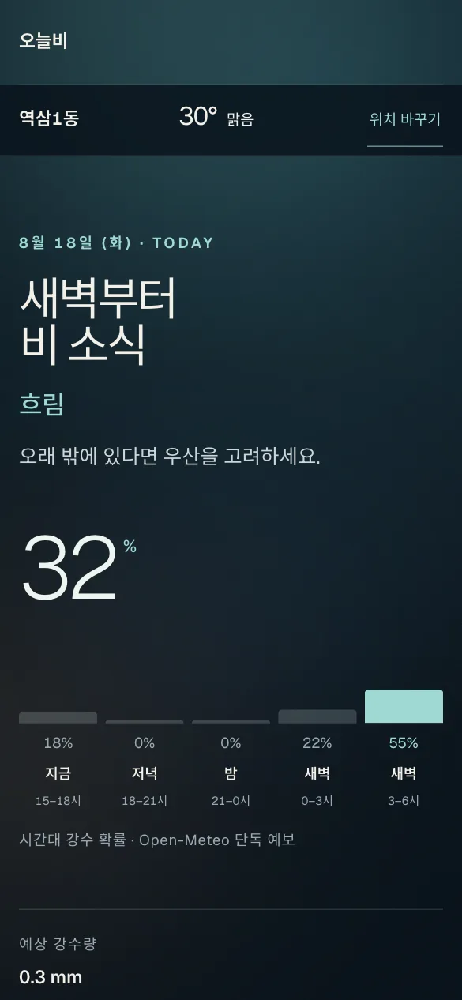
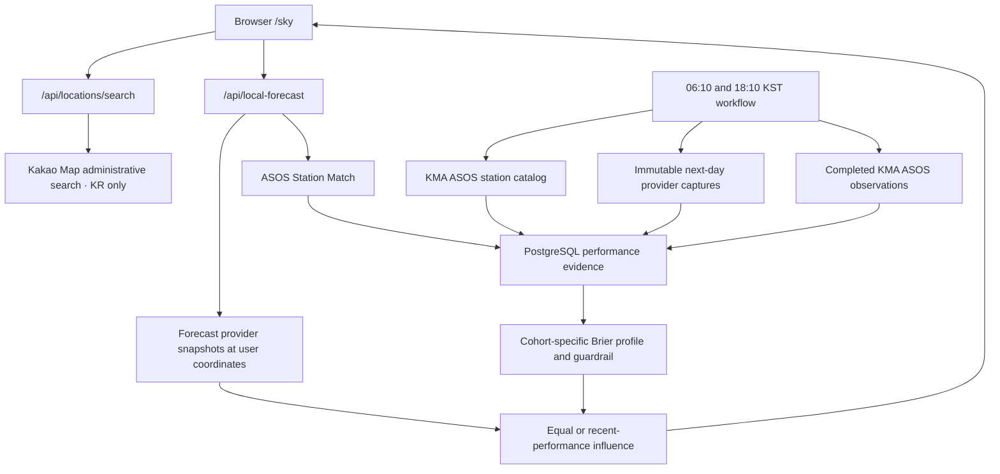

# 오늘비 · raintoday

[](https://nextjs.org/)
[](https://react.dev/)
[](https://www.typescriptlang.org/)
[](https://github.com/mhju0/raintoday/actions/workflows/local-performance.yml)

오늘비 ("rain today") is a South Korea local rain forecast. It leads with when rain is expected to arrive at the user's chosen coordinate and how likely it is today, carries tomorrow alongside them, and — when sufficient prospective evidence exists — adjusts each provider's influence on the next-day figure using the Recent Performance Profile from its KMA Station Match.

**Live demo:** [raintoday.vercel.app/sky](https://raintoday.vercel.app/sky)

The interface is Korean, for Korean users. The captions below describe what each screen shows.



*Nothing is requested until the visitor asks. The app never prompts for location automatically or infers it from an IP address.*



*The heading answers when, not whether — the probability alone cannot tell someone leaving at 09:00 from someone leaving at 21:00. The strip is one provider's hourly series and says so, because the figure beside it is a blend of several and the two must not read as the same claim. A time block nobody published shows a dash, never 0%.*



*Every provider that supplied a probability is shown with the figure it actually gave. When no local performance record exists yet, the page says so and averages them equally rather than drawing identical bars.*



*On a phone the strip sits above the detail rows: the answer is the arrival time, so it comes before the millimetres. The location bar stays pinned through the full scroll.*

## Product contract

- The forecast target is the user's exact submitted coordinate inside the supported South Korea service area, validated against official administrative boundaries.
- The user explicitly taps for browser geolocation or searches for a Korean place. The app does not prompt automatically or infer location from an IP address.
- User coordinates are used for the request and are not written to the performance database.
- Local performance is evidence from the KMA Station Match, not a claim that the station is the user's location.
- Rain probability is the initial accuracy target. Rain-amount error is reported separately and never substituted for probability accuracy.
- Until evidence passes every gate, the forecast uses equal influence among providers that supplied a valid value.

## How recent performance works

The [`local-performance`](.github/workflows/local-performance.yml) workflow runs at fixed 06:10 and 18:10 KST cohorts. For every active KMA ASOS station it can read, one run:

1. stores yesterday's completed daily precipitation observation;
2. captures each available provider's next-day rain probability and amount;
3. freezes the adaptive and equal-weight outputs before the outcome exists;
4. writes the immutable capture and corrected station-day observation to PostgreSQL.

The serving profile keeps the two capture cohorts separate. Provider probability performance uses all completed days—including dry days—with a 30-day operating window and a 14-day half-life. It reports Brier score, misses, false alarms, and rainy-day amount MAE. Public evidence also includes the latest seven-day Brier slice.

Learned influence requires at least 30 comparable captures per provider plus both wet and dry evidence. It ramps from equal to learned influence, applies provider floors and caps, and renormalizes over the providers that actually answered the current request. The Prospective Benchmark freezes adaptive and equal outputs before outcomes and suspends learning if the adaptive output regresses or lacks a fair comparison set.

Learned influence applies only to tomorrow, the lead time the Capture Cohorts measure. Days 2–7 remain an equal-provider outlook until those horizons have their own prospective evidence.

This supports the claim “weighted by recently observed local performance.” It does not yet support a claim that 오늘비 is more accurate overall; that requires accumulated prospective results.

## User flow

The primary route is `/sky`:

1. choose precise browser location or search for a Korean place;
2. see tomorrow's recommended rain probability and practical umbrella guidance;
3. see when rain is expected to arrive, as a time-of-day strip from a single named provider;
4. inspect each provider's current probability and influence;
5. inspect the Station Match, distance, evidence depth, recent Brier scores, misses, and false alarms;
6. review the longer precipitation outlook.

The restrained atmospheric background preserves the original cinematic character without presenting Seoul imagery as nationwide location evidence.

## Architecture



Important boundaries:

- `lib/location.ts` validates Korean coordinates and converts them to KMA grid coordinates.
- `lib/providers/*` reads normalized provider snapshots at a requested location.
- `lib/performance/performance.ts` owns scoring, evidence gates, bounded weights, and the Prospective Benchmark.
- `lib/performance/store.ts` defines persistence; `lib/performance/postgres.ts` is the production adapter.
- `lib/performance/capture.ts` freezes one station/cohort prediction; `lib/performance/batch.ts` orchestrates the nationwide bounded run.
- `lib/localForecast.ts` combines exact-coordinate forecasts with nearby-station evidence without persisting user coordinates.
- `lib/performance/influence.ts` derives Effective Influence and the blend it produces, for both the capture and serving paths.
- `lib/localForecastView.ts` projects that response onto the flat contract `/api/local-forecast` returns, so the page never reads the domain model directly.
- `lib/forecast/blocks.ts` folds a now-anchored hourly series into time-of-day blocks, shared by the `/sky` hero strip and the cinematic forecast section. A block with no published probability stays null rather than 0%.
- `app/api/local-forecast` and `app/api/locations/search` are rate-limited HTTP adapters.

`/` redirects to `/sky`, as do the retired `/atmosphere` and `/diagnostics` routes. The Seoul cinematic scene survives as the background of `/sky`, and `/api/sky` and `/api/weather` still serve it.

오늘비 runs a **second, older scoring pipeline** alongside the one above. `lib/reliability/` scores a single station (서울 108) with an online update, persists to the `reliability-state` branch, and feeds the live `/api/sky` snapshot; `lib/performance/` scores every eligible station in batch and feeds `/api/local-forecast`. They share a vocabulary and a bounded-weight contract but not an implementation, and are deliberately not merged — see [ADR 0004](docs/adr/0004-two-precipitation-scoring-pipelines.md).

## Documents

| Document | Contents |
| --- | --- |
| [`CONTEXT.md`](CONTEXT.md) | Domain glossary: Forecast Location, Station Match, Capture Cohort, Effective Influence, and the rest |
| [`docs/weather-sources.md`](docs/weather-sources.md) | Provider contracts, configuration, cache behavior, failure modes, and attribution |
| [`docs/adr/`](docs/adr/) | Decision records: reliability state, Korean location selection, service-area boundary, and the two scoring pipelines |
| [`docs/research/`](docs/research/) | Source evidence, including the SGIS boundary package's provenance and update procedure |
| [`lib/reliability/README.md`](lib/reliability/README.md) | The single-station precipitation-scoring pipeline |

## Stack

| Area | Technology |
| --- | --- |
| App | Next.js 16, React 19, TypeScript |
| Styling | Tailwind CSS 4 and custom responsive CSS |
| Forecasts | Open-Meteo, MET Norway, KMA, Pirate Weather, WeatherAPI |
| Ground truth | KMA ASOS daily precipitation |
| Persistence | PostgreSQL via Postgres.js |
| Scheduling | GitHub Actions at fixed KST cohorts |

## Run locally

Requires Node.js 22 or later.

```bash
npm ci
install -m 600 .env.example .env.local
npm run dev
```

Open [http://localhost:3000/sky](http://localhost:3000/sky). Open-Meteo provides a keyless forecast baseline; configure `KAKAO_REST_API_KEY` for Korean administrative-area search and for naming a device coordinate. Optional weather providers activate when configured.

To collect regional performance, configure:

- `PERFORMANCE_DATABASE_URL`: a standard PostgreSQL connection URL;
- `KMA_APIHUB_KEY`: subscribed to the KMA surface-observation station catalog;
- `KMA_OBSERVATION_API_KEY`: subscribed to the KMA ASOS daily service;
- optional provider credentials listed in [`.env.example`](.env.example).

Then run one fixed cohort:

```bash
npm run performance:capture -- --cohort=06
```

The scheduled workflow needs the same values as GitHub Actions secrets. If the database or station catalog is unavailable, the public forecast remains usable with an explicit equal-weight/no-evidence state.

## Verification

```bash
npm run lint
npx tsc --noEmit
npm test
npm run build
```

`npm test` runs the library suite and a JSDOM component suite. The PostgreSQL performance store is held to the same executable contract as the in-memory one, but only when a disposable database is supplied:

```bash
PERFORMANCE_STORE_CONTRACT_URL=postgres://… npm test
```

The suite truncates that database's tables, so it must never be a production URL. Without it, the PostgreSQL contract is reported as skipped rather than passing.

Manual product checks should cover:

- location permission only after the location button is pressed;
- Korea-only place search and location switching;
- desktop and narrow mobile layouts;
- equal influence when performance evidence is missing or insufficient;
- station name, distance, sample depth, and recent scores when evidence is active;
- no user coordinates in PostgreSQL performance tables.

## Limits

- Initial launch covers South Korea and precipitation only.
- Exact-coordinate admission uses the official SGIS 시도 boundary geometry, so offshore and cross-border coordinates are rejected. The geometry is simplified to a 10 m tolerance, so a decision within roughly 25 m of the coastline can differ from the unsimplified source. Manual place search remains country-filtered to Korea.
- ASOS is the first observation network. AWS eligibility remains a later audited expansion.
- Initial shadow-validation policy defaults are: station distance at most 100 km; elevation difference at most 400 m; rain at 0.1 mm; miss/false-alarm decisions at 50%; at least 30 comparable captures with both wet and dry evidence; influence ramping through 60 captures; provider influence bounded to 5–60%; and an `exp(-4 × Brier)` score transform. These values, including the one-wet-day minimum, require validation against shadow data before marketing local coverage or performance guarantees.
- A location may have no eligible observation station even when forecasts are available.
- Provider availability and forecast horizon vary; missing values are omitted, never treated as zero.
- Prospective evidence needs time to accumulate, so new stations begin with equal influence.
- Weather information is not suitable for safety-critical decisions.

## License

Copyright (c) 2026 Michael Ju. All rights reserved.
No license is granted for use, copying, modification, or distribution of this code as of 2026-07-30. This repository is public for portfolio review purposes only.
